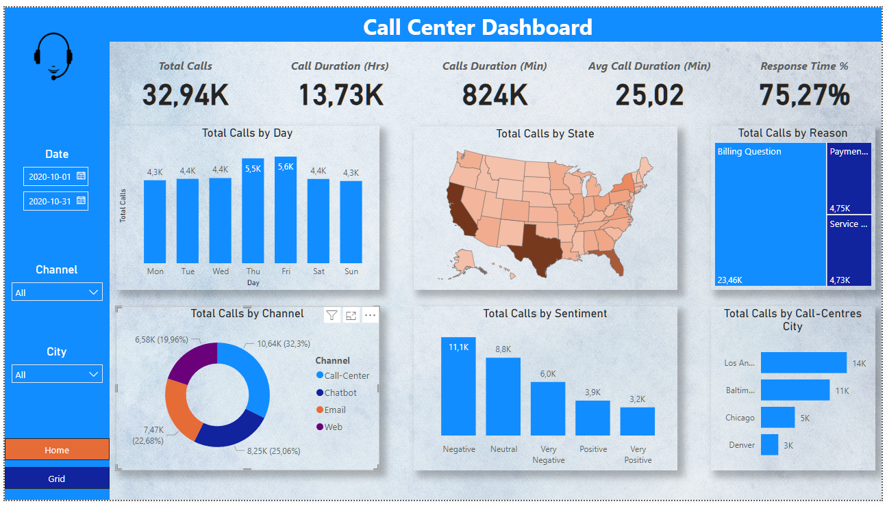
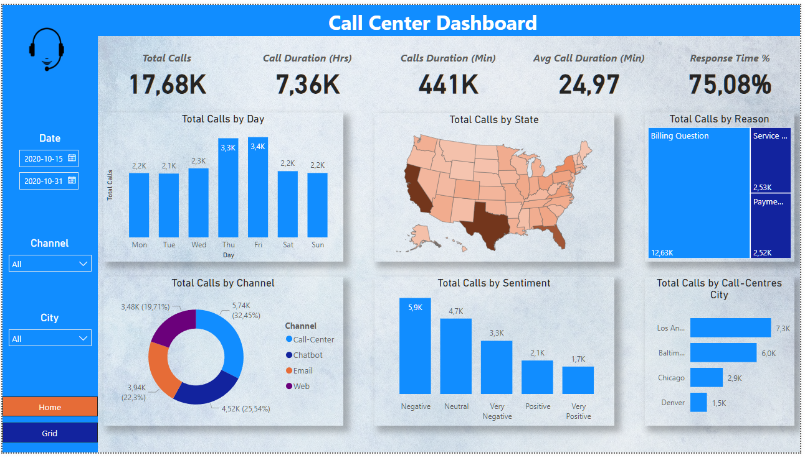
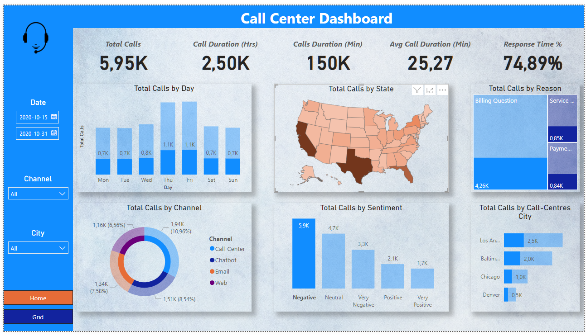
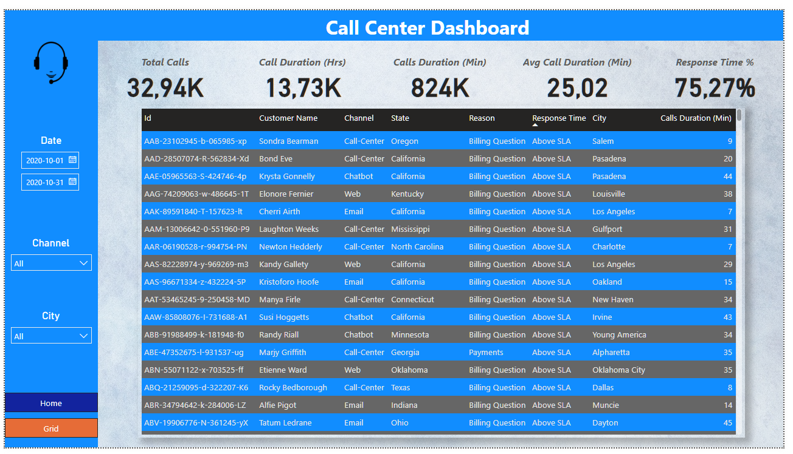

# Call Center Data Analysis Project

## Overview

This project involves an in-depth analysis of data from over 32,000 call center conversations in the United States. Leveraging Excel for initial data validation and cleaning, and subsequently utilizing PowerBI for visualization, this analysis aims to derive insights and metrics from the provided dataset.

## Tools Used

- **Excel:** Initial data exploration, coherence checking, and preliminary cleaning.
- **PowerBI:** Data visualization, organization using Power Query, and creation of key measures with Data Analysis Expressions (DAX).

## Dashboards

### Performance Dashboard

The primary dashboard focuses on key performance indicators (KPIs) including:

- Total number of connections
- Connection duration in hours and minutes
- Average conversation length
- Response time

Additional KPIs cover aspects such as connections by day of the week, geographical distribution on a USA map, distribution of calls by the discussed issue, technologies used for customer connection, post-call ratings, and an overall breakdown by the caller's city. Interactive filters are implemented for further data exploration, allowing users to filter by city, date, or technology.

Date filter used

Only negative sentiment

### Grid Dashboard

The secondary dashboard provides a tabular representation of the analyzed data, offering a comprehensive view of all key metrics in one accessible location.

## Usage

Explore the interactive elements and visualizations to gain valuable insights into call center interactions and performance metrics.

